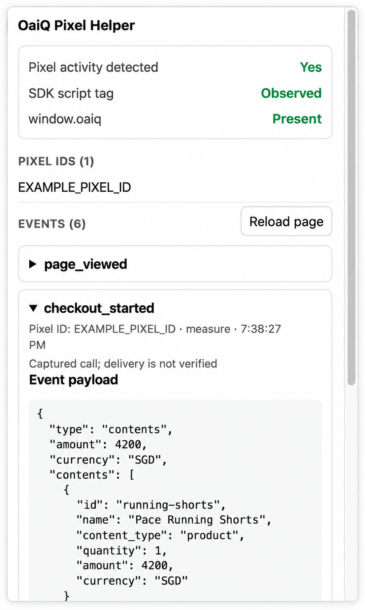

# OaiQ Pixel Helper

A Chrome extension for inspecting the OpenAI Ads Measurement Pixel (`oaiq`) on a webpage. It shows detected Pixel IDs and captures `measure` and `measureSingle` calls with their event payloads and options.

  

## Load locally in Chrome

1. Open `chrome://extensions`.
2. Turn on **Developer mode**.
3. Click **Load unpacked**.
4. Select this repository's `extension` folder—the folder containing `manifest.json`.
5. Pin **OaiQ Pixel Helper** from Chrome's Extensions menu.
6. Reload the webpage you want to inspect, then click the helper icon.

No build or dependency installation is required.

## After changing the extension

1. Open `chrome://extensions` and click **Reload** on the extension card.
2. Reload each webpage you want to inspect. Existing tabs keep the old content script until they are reloaded.

The toolbar badge shows the number of distinct Pixel IDs detected on the current tab. Events shown in the popup are calls captured from the page; their network delivery is not currently verified.
